# 云或移动项目管理服务软件——Business Case文档

## 前言
  
这是中山大学数据科学与计算机学院软件工程专业IT项目管理的第二次团队作业博客部分，由“全都实习没人干活组”博客小队完成。  
## 成员贡献  

 

## 竞争产品分析
## **1、码云**  

   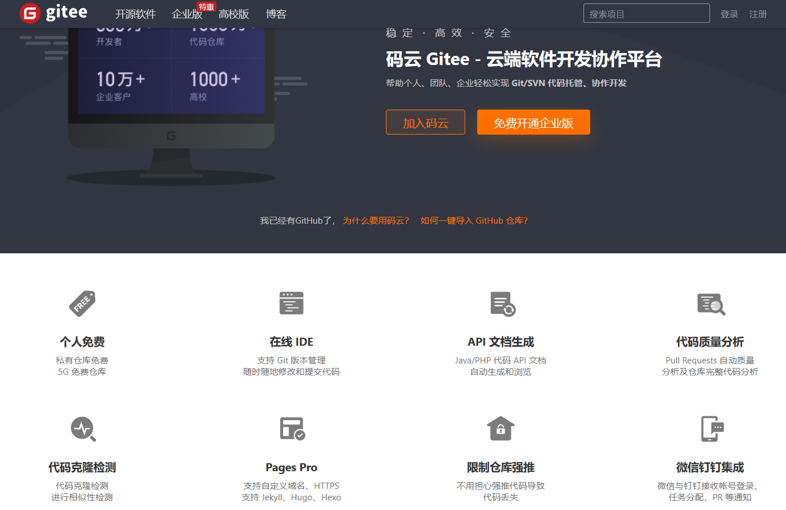  
   
### **产品特色**  
码云是基于Git的代码托管和云端软件开发协作平台  

- `中文界面`  
码云从某个层面来讲可以看作中文版Github，可以让团队交流更加效率。  

     

- `免费的私有库`  
其它几乎所有软件开发协作平台（如Github）将私有库作为收费功能，而码云免费提供私有库。  
   
   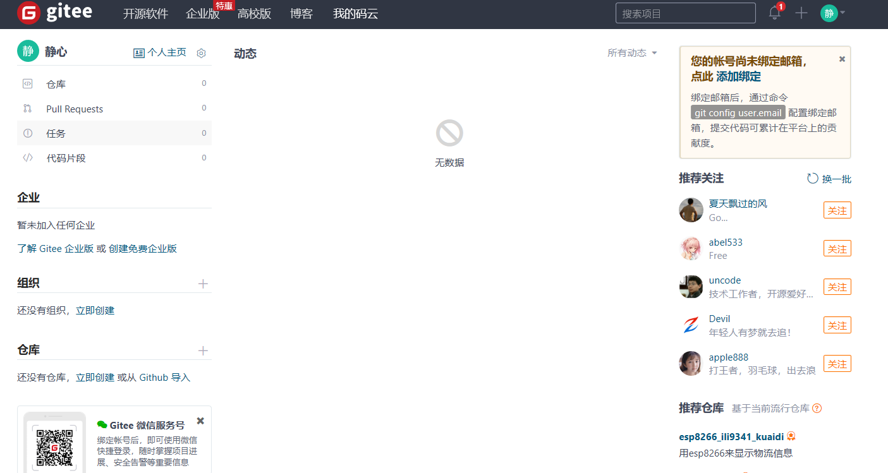  
   
- `完善的代码处理能力`  
拥有在线IDE可以随时修改、编译、运行代码，同时可以自动对仓库的代码进行质量分析（Sonar），并且还可以对代码进行相似性检测。
- `限制仓库强推`  
不用担心强推代码（-f参数）导致代码丢失
- `同时支持Git和SVN`  
能够同时使用Git和SVN进行代码托管  
……

### 业务支持
  
- `微信开发`
- `区块链应用开发`
- `WEB应用开发`
- `手机/移动开发`
- `数据库管理/监控`  
……
### 工具
- `在线IDE`  
支持 Git 版本管理，随时随地修改和提交代码
- `API 文档生成`  
Java/PHP 代码 API 文档自动生成和浏览
- `项目演示`  
可创建一个演示来部署并启动项目
- `代码质量分析`  
Pull Requests 自动质量分析及仓库完整代码分析
- `代码克隆检测`  
对代码进行相似性检测  
……
## 项目使用说明
### 功能介绍
对于云或移动项目管理服务软件,这里使用"码云"来作为功能演示的范例，首先作为一个云或移动项目管理服务软件，需要做到的是，对于团队来进行协作开发，包括但不限于代码共享，代码托管，任务发布与监控，权限管理等等。

### 主页面（工作台）

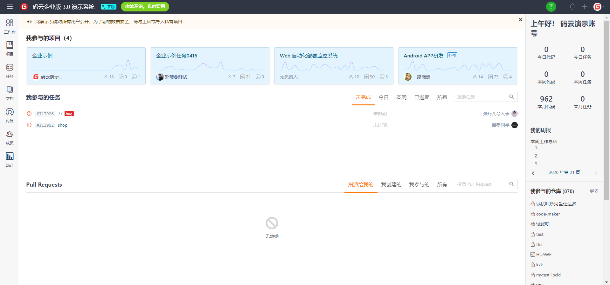

可以看到，主页面包括了参与项目，参与任务，项目完成情况，代码量，任务完成情况等信息，左侧一栏是各种具体功能，接下来我会一一介绍。

### 项目

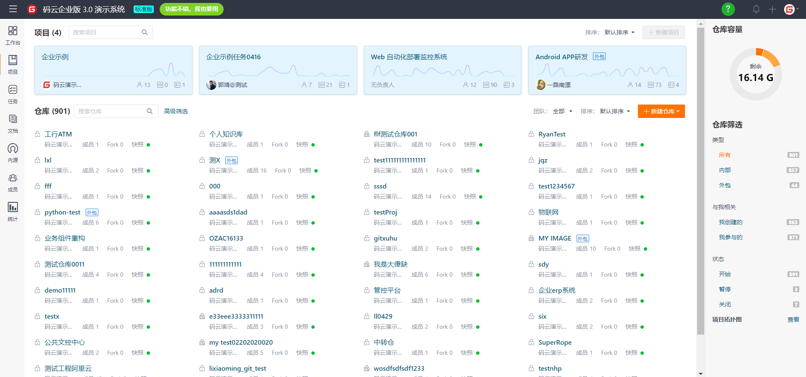

这一项是可以总体的看到我们负责的所有项目，包括参与的所有仓库，以及在右侧可以看到各种详细的项目信息。

点进项目之后，我们可以查看到关于具体项目的详细信息，包括项目成员，项目任务，任务完成情况，燃尽图等等信息，具体功能有包括pull Request,发布任务，建立仓库管理仓库等等。

其中最主要的就是可以查看任务的详细信息以及完成情况。这里的信息还包括任务类型，出现错误发布任务的仓库，任务负责人，任务讨论等等。

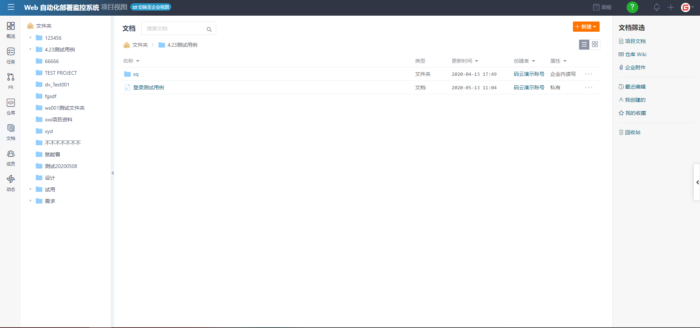

在文档内可以查看到根据文件夹分类的各种关于项目的说明文档，还可以根据条件筛选出要找的文档。

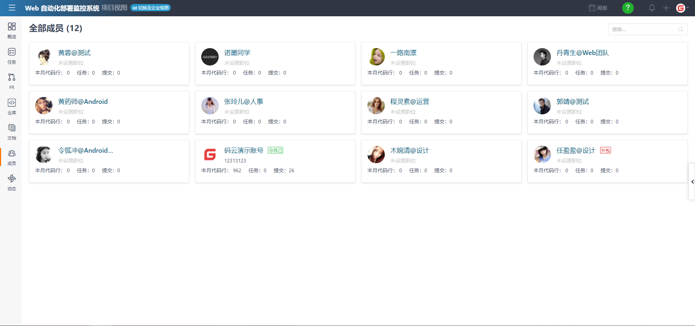

在成员这一项中可以看到各个成员本月的代码量以及任务完成情况，点击成员头像之后，还能以表格的形式查看到成员的详细信息。

### 任务

这里的任务和项目内部的任务其实没什么不同，可以总体的查看关于所有项目的完成情况和统计数据。

### 内源

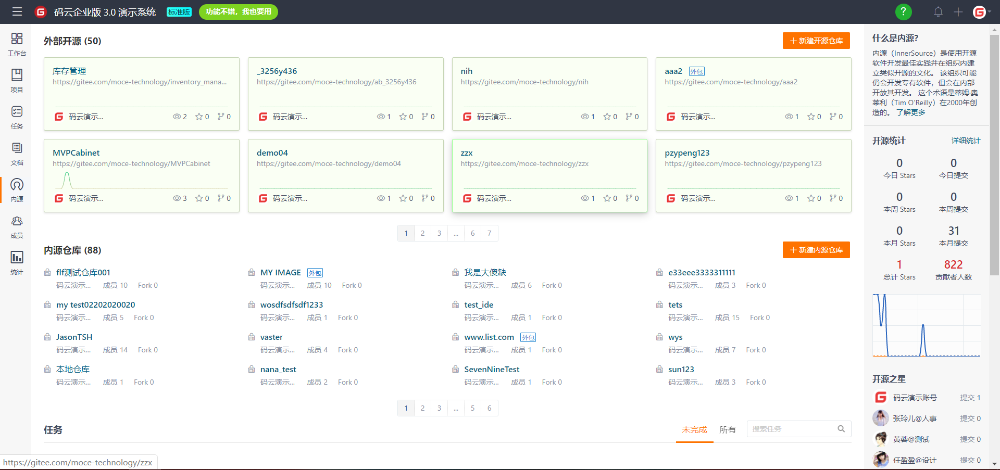

这里根据各种仓库的查看与修改权限，对各个仓库的资源进行了限制，根据当前账户的权限，给出开源的仓库以及内部的仓库。

### 统计

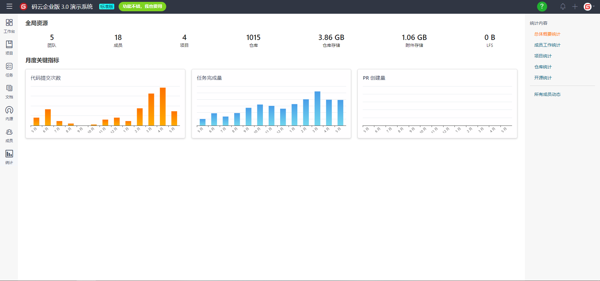

这项功能是通过图表的形式，清晰的展示了关于各个项目任务的各种指标，以此来评估成员对项目的贡献。

## 盈利模式分析

### 常见与运营模式
#### 30天免费试用

免费试用是一个非常常见的吸引用户的方式：

* 对于用户而言，30天的试用期不仅仅降低了成本，也获得了一段缓冲区来看软件是否满足自己的需求。

* 对于项目方，目前云计算市场已经进入到了价格战的阶段，前期必须依靠一定的让利才能占据市场份额，30天免费试用是不错的方案。

  例如全程云PM提供的移动项目管理软件，就使用的是这种模式

  

  

  而像国内云计算巨头腾讯云对于个人服务器甚至可以提供180天的云服务器，当然这只是基础云资源，与我们提出的移动项目管理软件不太相同

  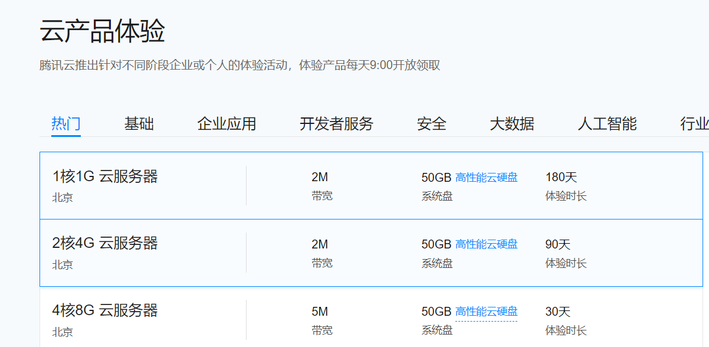

  在试用阶段可以免费使用项目管理、资源管理、预算管理、任务管理、费用报销、合同管理等基础功能，但是对于特色增值工具与定制化服务仍需付费

#### 按月付费

试用期之后需要进入付费阶段以保证盈利，腾讯云等云计算商的方案是按量计费与包年包月并行

这也是云计算的基本计费方式，但是由于服务性质的不同，按量计费并不太适合我们的项目，因此主要采用的是包年包月的模式

以码云企业版举例，虽然不按量计费，我们可以设置多种价位来提供给有不同需求的用户，尽可能满足客户要求，并避免资源浪费

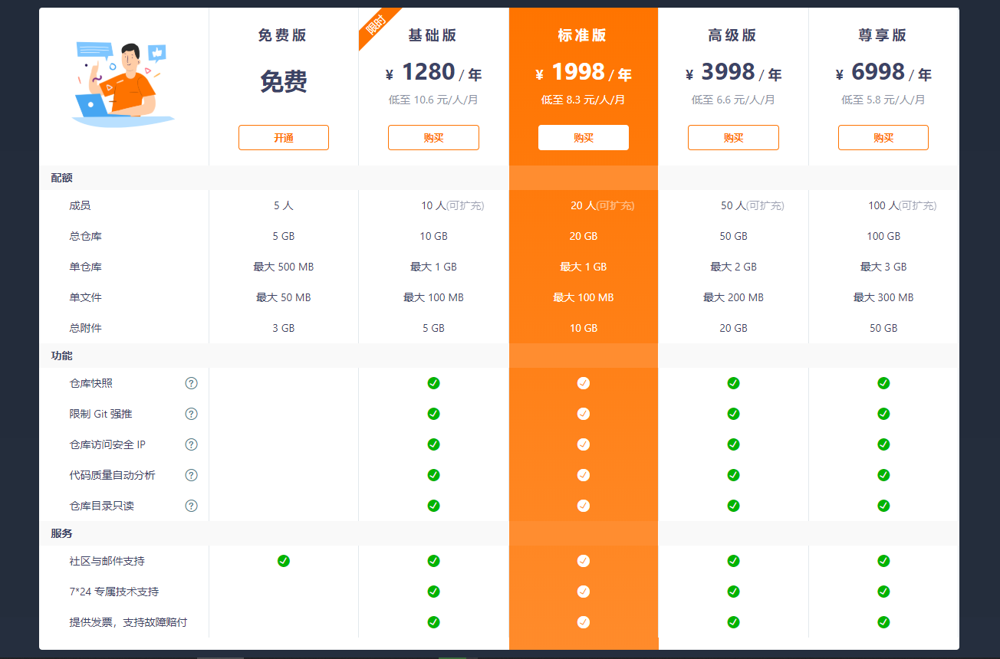

### 对Azure DevOps营销策略的分析

Azure DevOps(TFS)是微软旗下的团队软件开发管理产品，能够为敏捷开发提供良好的支撑。作为微软庞大的软件体系下的一员，尽管它采用的营销方式和大部分竞品较为相似，但在某些方面还是带有些许微软的风格。

Azure DevOps提供了云端版本（Azure DevOps Services）和本地版本（Azure DevOps Server），两种版本采取了不同的收费策略，根据用户选择的服务再进一步采取不同的收费策略。

#### 云版本

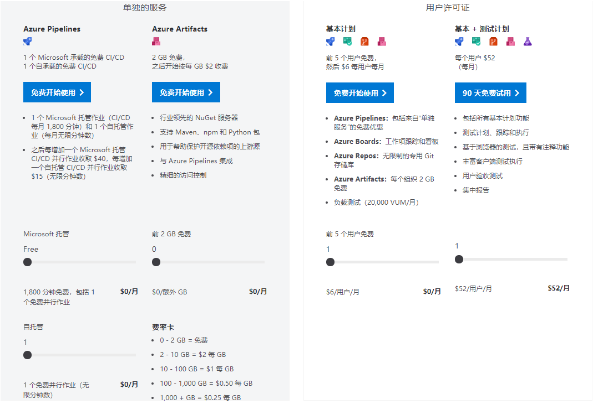

Azure DevOps依托微软自身强大的云服务资源作为支撑，能够在较大程度上降低它提供相关服务的成本，因此能够在价格拉锯战中具有先天优势，尤其是为小型的（敏捷开发）团队提供了近乎长期免费的服务（与Jira相似，对小型开发团队近乎免费），这一点是大部分提供软件开发管理服务的软件难以承担的。对于小团队的拉拢一方面不会造成太大的成本损耗，另一方面在一定程度上帮助其占据更大的市场份额，这笔钱相当于廉价的、性价比超高的宣传成本，并且能够帮助创造一个良好的社区环境，即使这笔钱再多一些凭借微软的体量也绝对烧得起。因此Azure DevOps的主要盈利来源主要还是中到大型团队或企业用户。

#### 本地版本

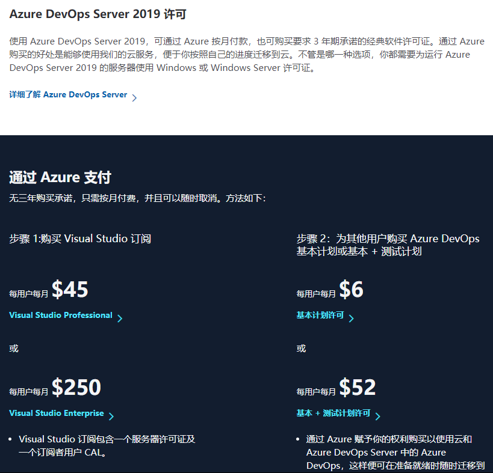

对于本地版本总体上采用的也是传统的先试用后收费的方式，相较于常见的15~30天的试用期，Azure DevOps Server提供了90天的试用期，让团队用户对其产生更强的依赖性；过了试用期后可以选择**购买3年期承诺的软件许可**，也可以选择以**月付**的方式进行付费，并且可随时取消，一紧一松的收费模式能够满足不同组织形式的团队进行选择，前者更加适用于企业用户或长期的合作团队，而后者对于有本地部署需求的敏捷开发自组织团队似乎更加友好。
具体的收费模式——

- 服务器端需要订阅Visual Studio专业版或企业版以获取服务器许可证从而进行部署
- 客户端用户需要订阅云版本中提及的基本计划，收费标准与其一致

值得注意的是本地部署要求操作系统为Windows Server，操作系统与软件的捆绑是微软的一贯套路，可以体现微软对其旗下产品的自信，不论是对操作系统还是对软件。

### 对我们产品盈利方式的启发

考虑到微软采用的营销策略是建立在它强大的云服务资源之上的，并且它不仅提供了较为完整的敏捷开发支撑，还提供了配套的软件测试工具（尽管需要另外收费），因此作为一个新生产品我们的定位要更加精细化，比如说，单就敏捷开发而言Azure DevOps相较于Jira还是存在不足，也就是说我们在这方面可以加以改进；另一方面，在试用期的长度问题上，在保证产品能够产生足够用户粘性的条件下，试用期在运营成本的控制下越长越好；还有一点就是在提供云服务这个问题上，最好能够为用户争取到性价比更高的云部署平台。

### 云与移动项目管理软件盈利模式-Atlassian 的轻销售模式

在企业的运营过程中，销售往往占据了大量的成本，对于向用户提供服务的公司而言，更是如此。成本的节约意味着利润的增长，因此将 Atlassian 的轻销售模式——关于如何节约销售成本的内容，作为类似项目的盈利模式进行阐述。事实上国内不少提供云平台服务的提供商也借鉴了这样的销售模式。

作为向客户提供服务的公司，销售人员听上去必不可少——无论是对潜在客户宣传自己的产品，还是向客户提供后续的支持，产品的方方面面都离不开销售人员。销售人员就像技术人员与客户间的“缓冲剂”。而没有“缓冲剂”的 Atlassian，却依旧赢得了良好的口碑，这与他们的做法密切相关：

* 全程自助——Atlassian通过官网销售，在主页上有完全透明的价格体系，用户选择好产品类型、团队人数和部署方式后，就可以清楚地看到价格，并立即申请试用。Atlassian还提供免费试用，方便用户根据试用结果按需购买。[^1]这种做法使得客户可以较少地依赖来自专业技术人员的帮助，也减少了公司对于销售人员的需求。

* 高效利用资本——要更好地抢占市场，并确保已有的客户不会流失，一个完备的产品族是必不可少的选择。但如果所有产品都需要重新开发，所耗费的代价是十分巨大的：不仅需要聘请大量的开发人员，而且极有可能因为进度太慢而被其它公司抢占先机——TextMate 就是因此被迫退出了编辑器市场。而在第一个产品 Jira 取得成功后，已经积累了一定资本的 Atlassian 没有选择将资本浪费在重新开发上，而是选择收购已经成型的产品。通过收购已有产品来丰富产品套件，扩大用户基数。为技术工程团队构建最好的项目管理工具，以此来开发具有品牌忠诚度的市场。这是 Atlassian 近十年来一直保持增长的主要原因[^2]。

* 细分用户——Atlassian 根植于开发者团队，将其作为进入企业的通道，然后向其他团队扩散。先让开发者团队深深爱上 Jira，再逐步让其他团队也开始使用 Atlassian 的产品套件。在刚开始很难取得全盘的胜利，因为要吸引所有人的注意是很困难的。相反，应该把精力聚焦在一个部门上，先向这一部分人布道你的产品，然后再想办法增长：通过研讨会和网络会议的方式向这部分人布道。向他们说明你的产品能够帮助他们解决什么问题，确保你的产品能够解决他们的痛点。[^3]

便捷的服务、对资本的高效利用和针对性的产品分发，是 Atlassian 虽然创立 18 年来一直没有企业级销售团队，却能将公司做到家喻户晓的重要原因。国内现在有不少公司也选择了借鉴这一策略，足以证明这一策略的良好意义。

[^1]: [知乎——没有一名销售的Atlassian，如何成长为知名的SaaS公司](https://zhuanlan.zhihu.com/p/27767550)
[^2]: [百度文库——Atlassian 不一样的发展模式](https://wenku.baidu.com/view/646657c2fc0a79563c1ec5da50e2524de418d04e.html)
[^3]: [CSDN——Atlassian：一家没有销售团队，不靠融资做到百亿美元市值的技术公司](https://blog.csdn.net/sanshengshi134/article/details/92556870)
